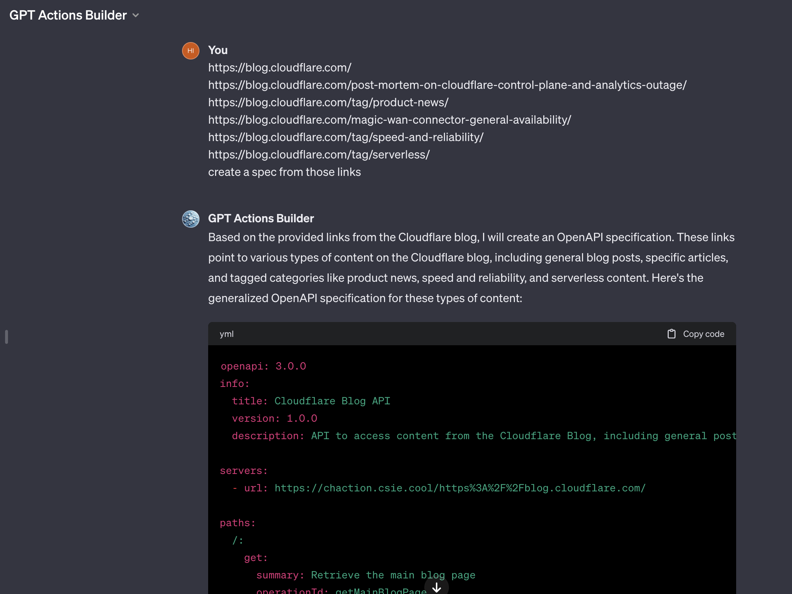
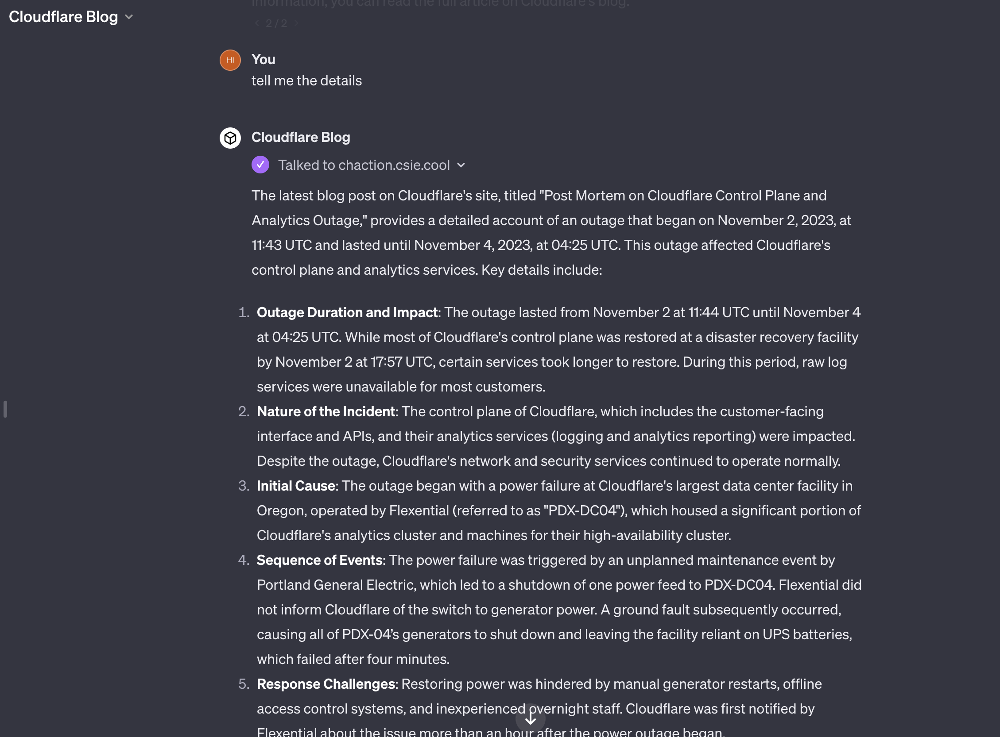

# ChatGPT Action Everywhere

Convert any website into a ChatGPT Action. Enable GPTs to interact with the whole world.

## Concept

"My GPTs" is an amazing feature that enables GPT to interact with external APIs through the "Action" feature by providing an OpenAPI specification.

As we know, Large Language Models (LLMs) excel in processing natural language. However, it appears that Actions can only consume JSON data. To enable LLMs to interact with the web, we need to build a bridge between the LLMs and the web.

This project serves as that bridge, converting webpages into JSON with Markdown content.

```scala
HTML -> Markdown -> JSON
```

## Usage

You can create the spec yourself, as detailed in [The Format](#the-format).

Alternatively, use the [GPT Actions Builder](https://chat.openai.com/g/g-QpAkNkwy4-gpt-actions-builder) to help you build the spec by providing some URLs.

[](https://chat.openai.com/share/1a97a1fb-53a1-4b4f-9589-e071e46e41c7)

> <https://chat.openai.com/share/1a97a1fb-53a1-4b4f-9589-e071e46e41c7>

## Example

I have successfully used this to convert Cloudflare's blog into a ChatGPT Action, and [it works well](https://chat.openai.com/g/g-9xYm107vz-cloudflare-blog).

[](https://chat.openai.com/share/89a639ef-51bf-4aaf-9d3d-7848823d7cda)

> <https://chat.openai.com/share/89a639ef-51bf-4aaf-9d3d-7848823d7cda>

## The Format

```yml
openapi: 3.0.0
info:
    title: Some API
    version: 0.0.0
    description: Some API :)
servers:
    - url: https://chaction.csie.cool/<urlencoded-origin-server>/

paths:
    /index.php/news/:
        get:
            summary: The latest news list
            operationId: list
            responses:
                "200":
                    description: ok
                    content:
                        application/json:
                            schema:
                                type: object
                                properties:
                                    content:
                                        type: string
                                        description: The page content

    /index.php/{year}/{month}/{day}/{slug}/:
        get:
            summary: Get the news detail
            operationId: fetch
            parameters:
                - name: year
                  in: path
                  description: The year
                  required: true
                  schema:
                      type: integer
                - name: month
                  in: path
                  description: The month
                  required: true
                  schema:
                      type: integer
                - name: day
                  in: path
                  description: The day
                  required: true
                  schema:
                      type: integer
                - name: slug
                  in: path
                  description: The slug
                  required: true
                  schema:
                      type: string
            responses:
                "200":
                    description: ok
                    content:
                        application/json:
                            schema:
                                type: object
                                properties:
                                    content:
                                        type: string
                                        description: The page content
```

For the origin server, encode the URL using `encodeURIComponent` in JavaScript.

For example, encode `https://www.csie.ntnu.edu.tw` as `https%3A%2F%2Fwww.csie.ntnu.edu.tw`.
